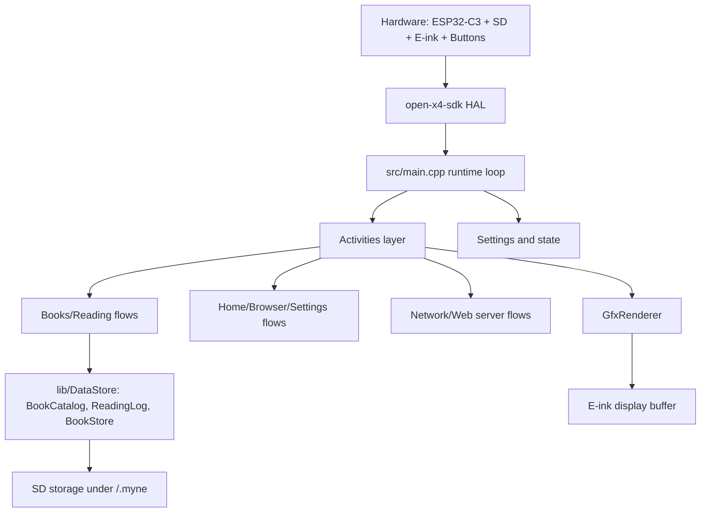
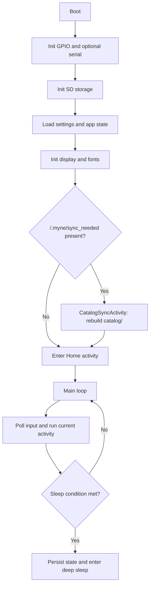

# Architecture Overview

Myne is firmware for the Xteink X4 (unaffiliated with Xteink), built with PlatformIO targeting the
ESP32-C3 microcontroller. It is a personal fork of [CrossPoint](https://github.com/crosspoint-reader/crosspoint-reader)
repurposed to catalog a library of physical books and track reading sessions for them, with a companion
React dashboard for managing the catalog and SD card over Wi-Fi.

At a high level, it is firmware that uses an activity-driven application architecture loop with
persistent settings/state, an SD-card-backed book catalog and reading log, and a rendering pipeline
optimized for e-ink constraints.

## System at a glance



## Runtime lifecycle

Primary entry point is `src/main.cpp`.



In each loop iteration, the firmware updates input, runs the active activity, handles auto-sleep/power
behavior, and applies a short delay policy to balance responsiveness and power.

## Activity model

Activities are screen-level controllers deriving from `src/activities/Activity.h`. A single
`ActivityManager` (see [activity-manager.md](../activity-manager.md)) owns the render task and an
activity stack — `startActivityForResult()` / `setResult()` / `finish()` push and pop child activities
with typed results.

- `onEnter()` and `onExit()` manage setup/teardown
- `loop()` handles per-frame behavior
- `skipLoopDelay()` and `preventAutoSleep()` are used by long-running flows (for example web server mode)

Top-level activity groups:

- `src/activities/home/`: home screen (2×3 icon grid, last-read shortcut)
- `src/activities/books/`: physical book catalog, collections, reading sessions, and stats
- `src/activities/browser/`: SD card file browser
- `src/activities/settings/`: settings menus and configuration
- `src/activities/network/`: WiFi selection, AP/STA mode, web server/dashboard
- `src/activities/boot_sleep/`: boot and sleep transitions
- `src/activities/util/`: shared utilities (keyboard entry, confirmation dialogs, crash report, etc.)

## Book catalog and reading pipeline

Physical books and their reading sessions are stored as JSON/NDJSON under `/.myne/` (source of truth),
with a denormalized `catalog/` index and small binary caches for fast on-device browsing. See
[book-catalog-format.md](../book-catalog-format.md) for the full on-disk format.

```mermaid
flowchart LR
    A[CatalogSyncActivity] --> B["BookCatalog: rebuild catalog/ from books/ + collections.ndjson"]
    B --> C[LetterPickerActivity]
    C --> D[LetterBooksActivity / CollectionBooksActivity]
    D --> E[PhysicalBookDetailActivity]
    E --> F[BookReadingsActivity]
    F --> G["ReadingEditActivity: log a session"]
    G --> H["ReadingLog: append session, refresh readings-sum cache"]
    H --> I[ReadingStatsActivity / BookReadingStatsActivity]
    I --> J[stats-cache]
```



Why caching matters:

- RAM is limited on ESP32-C3, so the catalog index and stats are precomputed and cached as small binary
  files instead of being recomputed from JSON on every screen
- `catalog/`, `readings-sum/`, and `stats-cache/` are all derived data — they're rebuilt from `books/`,
  `readings/`, and `collections.ndjson` whenever `/.myne/sync_needed` is present (shown on-device as the
  "Rebuilding catalog…" screen)

## State and persistence

Two singletons are central:

- `src/MyneSettings.h` (`SETTINGS`): user preferences and behavior flags
- `src/MyneState.h` (`APP_STATE`): runtime/session state (e.g. recent sleep images)

Typical persisted areas on SD:

```text
/.myne/
  books/{id}.json
  readings/{bookId}.json
  catalog/...
  collections.ndjson
  notes/books/{bookId}.note
  notes/collections/{id8}.note
  readings-sum/{bookId}.bin
  stats-cache/...
  settings.json
  state.bin
  sync_needed
```

For the book catalog and reading-log formats, see [book-catalog-format.md](../book-catalog-format.md).

## Networking architecture

Network file transfer and the dashboard are controlled by
`src/activities/network/MyneWebServerActivity.h` and served by `src/network/MyneWebServer.h`.

Modes:

- STA: join existing WiFi network
- AP: create hotspot

Server behavior:

- HTTP server on port 80, serving the companion dashboard (`dashboard/`) and its JSON API
- WebSocket upload server on port 81
- file operations backed by SD storage; book catalog/reading-log operations backed by `lib/DataStore/`
- activity requests faster loop responsiveness while the server is running

Endpoint reference: [webserver-endpoints.md](../webserver-endpoints.md).

## Build-time generated assets

Some sources are generated and should not be edited manually.

- `scripts/build_html.py` generates `src/network/html/*.generated.h` from the dashboard's built
  `dist/index.html` (see [dashboard/README.md](../../dashboard/README.md))
- `scripts/build_icons.py` generates `src/components/icons/*.h` from SVGs in
  `src/components/icons/src/`
- `scripts/gen_i18n.py` generates `lib/I18n/I18nKeys.h`, `I18nStrings.h`, and `I18nStrings.cpp` from
  `lib/I18n/translations/*.yaml`

When editing related source assets, regenerate via the scripts above (the generated files are
gitignored and not committed).

## Key directories

- `src/`: app orchestration, settings/state, and activity implementations
- `src/network/`: web server (dashboard + JSON API) and OTA/update networking
- `src/components/`: `MyneUI` and shared UI components/icons
- `lib/DataStore/`: physical book catalog, reading log, and book store (JSON/NDJSON + binary caches)
- `lib/`: supporting libraries (fonts, JSON parsing, i18n, filesystem helpers, etc.)
- `open-x4-sdk/`: hardware SDK submodule (display, input, storage, battery)
- `dashboard/`: companion React web dashboard, built and embedded into the firmware
- `docs/`: user and technical documentation

## Embedded constraints that shape design

- constrained RAM drives SD-first storage and careful allocations
- e-ink refresh cost drives render/update batching choices
- main loop responsiveness matters for input, power handling, and watchdog safety
- background/network flows must cooperate with sleep and loop timing logic

## Scope guardrails

Before implementing larger ideas, check:

- [SCOPE.md](../../SCOPE.md)
- [GOVERNANCE.md](../../GOVERNANCE.md)
